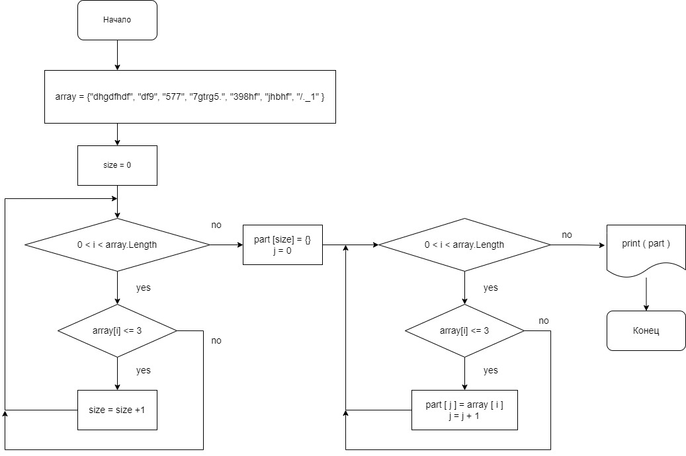

# **Итоговая проверочная работа:**

## Написать программу, которая из имеющегося массива строк сформирует новый массив строк, длина которых будет меньше либо равна 3.

**Так получилось, что программу написал 2мя способами:**
1. обычный код без использования методов, занял порядка 20 строк;
        commit 4bb5c5795fd62e1ee85c8a3d1185fe45cadd7f0b
        Итоговая работа. Формирование строчного массива.Вывод.3
        
2. код с использованием методов, занял порядка 60 строк;
        commit 82aec486cc8cc102efe2c7d0f4cbe57d97f31133
        Итоговая работа. Формирование строчного массива.Методы.5

## Описание решения №1
1. сформировал в коде массив со строковыми элементами
2. в цикле сосчитал количество элементов этого массива, длина которых будет меньше либо равна 3.
3. сформировал новый пустой массив
4. в цикле с условием заполнил новый массив элементами, длина которых будет меньше либо равна 3.

## Описание решения №2
1. создал 4 метода (идут ниже основного кода программы):
    * Метод ввода целого числа пользователем
    * Метод формирования начального строкового массива с терминала
    * Метод определения длины результирующего массива
    * Метод формирования нового массива с элементами не более 3х символов
2. в первой половине кода идет обращение к первым двум методам для ввода данных и формирования из них 1го массива
3. следующими двумя методами формируется новый массив
4. далее идет код вывода первого и результирующего массивов

